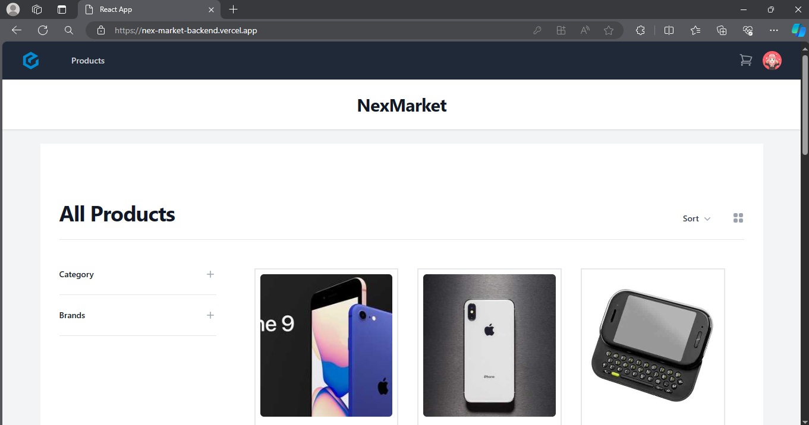
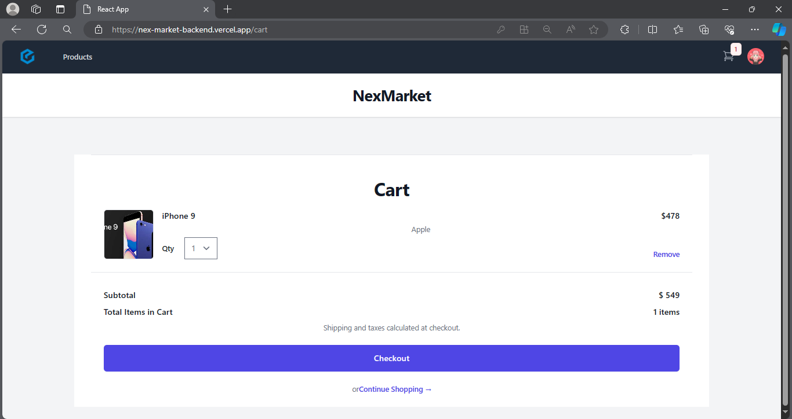
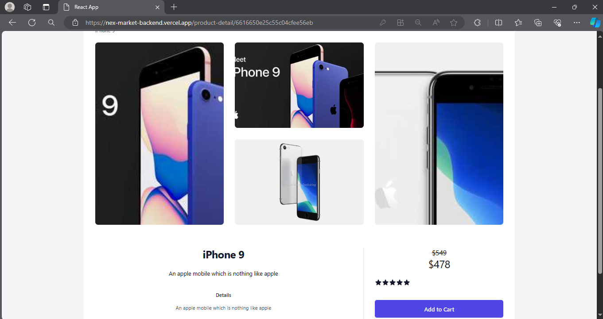

# NexMarket

🔗 Code Repositories:
- React [frontend] - https://github.com/DakshitaJain0212/NexMarket-frontend
- Node [backend] - https://github.com/DakshitaJain0212/NexMarket-Backend

Preview: 

  
    
  Home Page

  
    
  Cart

  
    
  Product Details

 Features :
- Secure Card Payments / Cash payments
- Admin Panel - Add/Edit Orders. Add/Edit Products
- Order Emails, Reset Password Emails
- User Profile and user orders

 Technical Details :
- React 18 with Tailwind CSS
- Redux Toolkit with Async Thunk
- MongoDB for Database
- REST API using Express
- API Authentication using JWT token
- MongoDB Atlas cloud database
- Email using Nodemailer - using GMail SMTP system
- Payments using Stripe - PaymentIntent based custom flow
